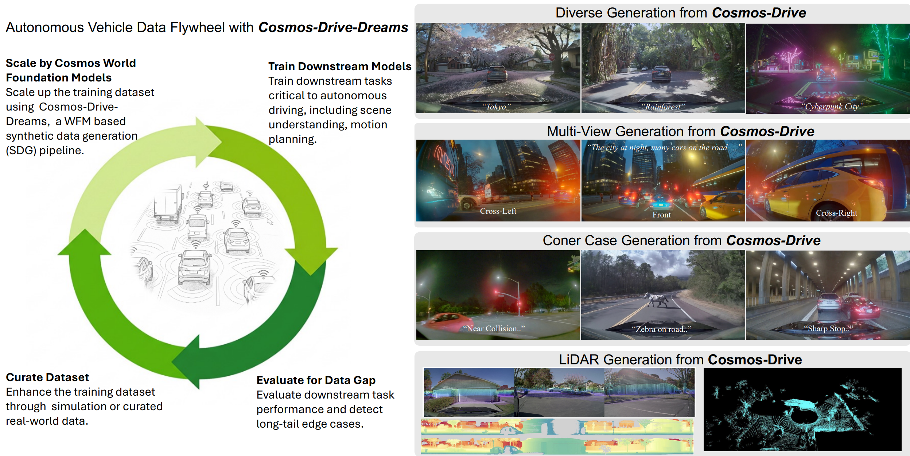

# Cosmos-Drive-Dreams
### [Paper]() | [Hugging Face](https://huggingface.co/datasets/nvidia/PhysicalAI-Autonomous-Vehicle-Cosmos-Synthetic) | [Paper Website](https://research.nvidia.com/labs/toronto-ai/cosmos_drive_dreams)
This is the official code repository of Cosmos-Drive-Dreams - a Synthetic Data Generation (**SDG**) pipeline built on [Cosmos World Foundation Models](https://www.nvidia.com/en-us/ai/cosmos/) for generating diverse and challenging scenarios for Autonomous Vehicle use-cases. 
<p align="center">
    
</p>

Currently, this repository implements the following stages of the Cosmos-Drive-Dreams pipeline:
1. Rendering structured labels to condition videos
2. Prompt rewriting 
3. Front-view video generation
3. Multi-view expansion
4. Filtering via VLM

Furthermore, this repository provides a full toolkit for visualizing structured labels [here](), editing structured labels interactively to produce novel scenarios [here](), and converting Waymo Open Dataset to our format [here]().

Other stages, such as inferring condition video from unlabled RGB video and LiDAR Generation from multi-view video will soon arrive to this repo. 

## Getting Started
We provide a simple walkthrough including all stages of our SDG pipeline through example data available in the assets folder, no additional data download is neccessary. 

### Installation and Model Downloading
We recommend using conda for managing your environment. Detailed instructions for setting up Cosmos-Drive-Dreams can be found in [INSTALL.md](INSTALL.md).

#### 1. Preprocessing Condition Videos
`cosmos-drive-dreams-toolkits/render_from_rds_hq.py` is used to render the HD map + bounding box / LiDAR condition videos from RDS-HQ dataset. 
In this example we will only be rendering the HD map + bounding box condition videos.
Note that GPU is required for rendering LiDAR. 
```bash
cd cosmos-drive-dreams-toolkits

# generate multi-view condition videos.
# if you just want to generate front-view videos, replace `-d rds_hq_mv` with `-d rds_hq`
python render_from_rds_hq.py -i ../assets/example -o ../outputs -d rds_hq_mv --skip lidar
cd ..
```
This will automatically launch multiple jobs based on [Ray](https://docs.ray.io/en/releases-2.4.0/index.html) for data parallelization, but since we are only processing 1 clip here, it will be only using 1 worker. The script should return in under a minute and produce a new directory at `outputs/hdmap`:
```bash
outputs/
└── hdmap/
    ├── ftheta_camera_cross_left_120fov
    │   └── 2d23a1f4-c269-46aa-8e7d-1bb595d1e421_2445376400000_2445396400000_0.mp4
    ├── ftheta_camera_cross_right_120fov
    │   └── 2d23a1f4-c269-46aa-8e7d-1bb595d1e421_2445376400000_2445396400000_0.mp4
    ├── ftheta_camera_front_wide_120fov
    │   └── 2d23a1f4-c269-46aa-8e7d-1bb595d1e421_2445376400000_2445396400000_0.mp4
    ├── ftheta_camera_rear_left_120fov
        └── 2d23a1f4-c269-46aa-8e7d-1bb595d1e421_2445376400000_2445396400000_0.mp4
    ...
```
The suffix `_0` means it is the first chunk of the video, which will be 121-frame long.

#### 2. Prompt Rewriting
A prompt describing a possible manifestation for the example can be found in `assets/example/captions/2d23*.txt`. We can use a VLM ([Qwen3](https://github.com/QwenLM/Qwen3) to be exact) to augment this single prompt into many variations as follows: 
```bash
python scripts/rewrite_caption.py -i assets/example/captions -o outputs/captions
```
The output will be saved at `outputs/captions/2d23*json`.

#### 3. Front-view Video Generation
Next, we use [Cosmos-Transfer1-7b-Sample-AV](https://github.com/nvidia-cosmos/cosmos-transfer1/blob/main/examples/inference_cosmos_transfer1_7b_sample_av.md) to generate a 121-frame RGB video from the HD Map condition video and text prompt. 
```bash
PYTHONPATH="cosmos-transfer1" python scripts/generate_video_single_view.py --caption_path outputs/captions --input_path outputs --video_save_folder outputs/single_view --checkpoint_dir checkpoints/ --is_av_sample --controlnet_specs cosmos-transfer1/assets/sample_av_hdmap_spec.json
```
#### 4. Multiview Video Generation
TODO
#### 5. Filtering via VLM
TODO?