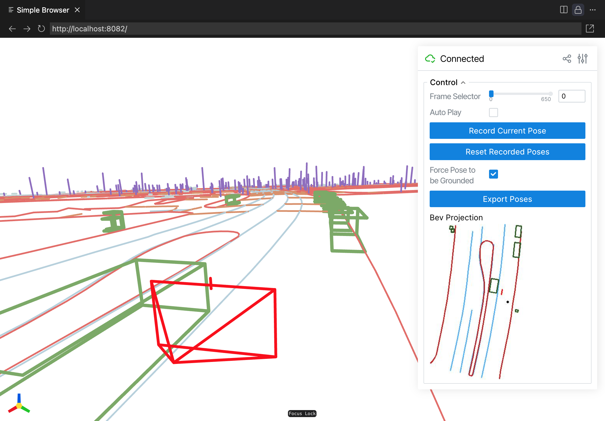

# Cosmos-AV-Sample Toolkits
This repo provides toolkits for:

* A rendering script that converts RDS-HQ datasets into input videos (LiDAR and HDMAP) compatible with [**Cosmos-Transfer1-7B-Sample-AV**](https://github.com/nvidia-cosmos/cosmos-transfer1/blob/main/examples/inference_cosmos_transfer1_7b_sample_av.md).

* A conversion script that converts open-source datasets (e.g., Waymo Open Dataset) into RDS-HQ format, so you can reuse the rendering script to render the input videos.

* An interactive visualization tool to visualize the RDS-HQ dataset and generate novel ego trajectories.

* 10 examples (collected by NVIDIA) of input prompts in raw format to help understand how to interface with the model. 

**[[Paper]](https://arxiv.org/abs/2503.14492)**
**[[Model Code]](https://github.com/nvidia-cosmos/cosmos-transfer1)**
**[[Website]](https://research.nvidia.com/labs/dir/cosmos-transfer1/)**

<div align="center">
  
</div>

## Quick Start

We provide pre-rendered examples [here](https://huggingface.co/datasets/nvidia/Cosmos-Transfer1-7B-Sample-AV-Data-Example/tree/main/examples) (rendered HDMAP / rendered LiDAR / text prompts). You can download and use these examples to test [**Cosmos-Transfer1-7B-Sample-AV**](https://github.com/nvidia-cosmos/cosmos-transfer1)!

## Installation
```bash
git clone https://github.com/nv-tlabs/cosmos-av-sample-toolkits.git
cd cosmos-av-sample-toolkits
conda env create -f environment.yaml
conda activate cosmos-av-toolkits
```

## Download Examples
We provide 10 examples of input prompts with HD map and LiDAR, to help test the model.
1. Add your SSH public key to your [user settings](https://huggingface.co/settings/keys) on Hugging Face.
2. Download the examples from [Hugging Face](https://huggingface.co/datasets/nvidia/Cosmos-Transfer1-7B-Sample-AV-Data-Example) (about 8GB):
```bash
git lfs install
git clone git@hf.co:datasets/nvidia/Cosmos-Transfer1-7B-Sample-AV-Data-Example
```

## Visualize Dataset
You can use `visualize_rds_hq.py` to visualize the RDS-HQ dataset.
```bash
python visualize_rds_hq.py -i <RDS_HQ_FOLDER> -c <CLIP_ID>
```
This python script will launch a [viser](https://github.com/nerfstudio-project/viser) server to visualize the 3D HD map world with dynamic bounding boxes. You can use 
- `w a s d` to control camera's position
- `q e` to control camera's z-axis coordinate



> [!NOTE]
> You can run this script in a server with VS Code + remote-ssh plugin. VS Code will automatically forward the port of viser to the local host. 


## Rendering Cosmos Input Control Video
You can use `render_from_rds_hq.py` to render the HD map + bounding box / LiDAR condition videos from RDS-HQ dataset. GPU is required for rendering LiDAR.
```bash
python render_from_rds_hq.py -i <RDS_HQ_FOLDER> -o <OUTPUT_FOLDER> [--skip hdmap] [--skip lidar]
```
This will automatically launch multiple jobs based on [Ray](https://docs.ray.io/en/releases-2.4.0/index.html). If you want to use single process (e.g. for debugging), you can set `USE_RAY=False` in `render_from_rds_hq.py`. You can add `--skip hdmap` or `--skip lidar` to skip the rendering of HD map and LiDAR, respectively. 

**RDS-HQ Rendering Results**
<div align="center">
  
</div>

> [!NOTE]
> If you're interested, we offer [documentation](./assets/ftheta.pdf) that explains the NVIDIA f-theta camera in detail.


The output folder structure will be like this. Note that `rgb` will only be generated when setting `--post_training true`.
```bash
<OUTPUT_FOLDER>
├── camera_name_1
│   └── hdmap
│       ├── <CLIP_ID>_0.mp4
│       ├── <CLIP_ID>_1.mp4
│       └── ...
│
│   └── lidar
│       ├── <CLIP_ID>_0.mp4
│       ├── <CLIP_ID>_1.mp4
│       └── ...
│
│   └── rgb
│       ├── <CLIP_ID>_0.mp4
│       ├── <CLIP_ID>_1.mp4
│       └── ...
│ 
├── camera_name_2
│    └── ...
│
└── ...
```

## Convert Public Datasets

We provide a conversion and rendering script for the Waymo Open Dataset as an example of how information from another AV source can interface with the model. Note that our model is not trained on the Waymo dataset, and this script is intended to help users better understand our data format. As a result, a drop in generative video quality is expected. Finetuning on the desired custom dataset would be beneficial to improve quality.

### Waymo Open Dataset
Parsing tfrecords from Waymo Open Dataset requires extra dependencies; install it with
```bash
pip install waymo-open-dataset-tf-2-11-0==1.6.1
```

#### Step 0: Check Our Provided Captions
We provide auto-generated captions for the Waymo dataset at [`assets/waymo_caption.csv`](./assets/waymo_caption.csv). You will need these captions to run [**Cosmos-Transfer1-7B-Sample-AV**](https://github.com/nvidia-cosmos/cosmos-transfer1/blob/main/examples/inference_cosmos_transfer1_7b_sample_av.md).

#### Step 1: Download Waymo Open Dataset

Download the all the training & validation clips from [waymo perception dataset v1.4.2](https://waymo.com/open/download/) to the `<WAYMO_TFRECORDS_FOLDER>`. 

If you have `sudo`, you can use [gcloud](https://cloud.google.com/storage/docs/discover-object-storage-gcloud) to download them from terminal.
<details>
<summary><span style="font-weight: bold;">gcloud installation (need sudo) and downloading from terminal</span></summary>

```bash
sudo apt-get update
sudo apt-get install apt-transport-https ca-certificates gnupg curl
curl https://packages.cloud.google.com/apt/doc/apt-key.gpg | sudo gpg --dearmor -o /usr/share/keyrings/cloud.google.gpg
echo "deb [signed-by=/usr/share/keyrings/cloud.google.gpg] https://packages.cloud.google.com/apt cloud-sdk main" | sudo tee -a /etc/apt/sources.list.d/google-cloud-sdk.list
sudo apt-get update && sudo apt-get install google-cloud-cli
```

Then you can login your google account and download the above tfrecords via
```bash
# or use `gcloud init --no-launch-browser` if you are in a remote terminal session
gcloud init 
bash download_waymo.sh config/waymo_all.json <WAYMO_TFRECORDS_FOLDER>
```
</details>

After downloading tfrecord files, we expect a folder structure as follows:
```bash
<WAYMO_TFRECORDS_FOLDER>
|-- segment-10247954040621004675_2180_000_2200_000_with_camera_labels.tfrecord
|-- segment-11379226583756500423_6230_810_6250_810_with_camera_labels.tfrecord
|-- ...
`-- segment-1172406780360799916_1660_000_1680_000_with_camera_labels.tfrecord
```

> [!NOTE]
> If you download the tfrecord files from the console, you will have prefixes like `individual_files_training_` or `individual_files_validation_`. Make sure these prefixes are removed before further processing.


#### Step 2: Convert Waymo Open Dataset to RDS-HQ format
First, convert the Waymo Open Dataset to RDS-HQ format. Suppose you have a folder with Waymo Open Dataset's tfrecords, you can convert it to RDS-HQ format by:
```bash
python convert_waymo_to_rds_hq.py -i <WAYMO_TFRECORDS_FOLDER> -o waymo_demo
```
Here we specify the output folder as `waymo_demo`; you can change it to any other one. 

#### Step 3: Render HD map + bounding box / LiDAR condition video from RDS-HQ format
Since we have converted Waymo Open Dataset's map labels and LiDAR points into the RDS-HQ format, we can render the HD map + bounding box / LiDAR conditioned video using the same script. The cameras in Waymo's Open dataset are pinhole camera models. To align with our model's training domain, we suggest using the same f-theta camera intrinsics to do the projection. We provide a default f-theta camera intrinsics in `config/default_ftheta_intrinsic.tar`, and you can render with f-theta camera by:
```bash
python render_from_rds_hq.py -d waymo -i waymo_demo -o waymo_demo_render_ftheta -c ftheta
```
here `-d` is the dataset name, you can find its configuration in `config/dataset_waymo.json`, `-i` is the input folder, `-o` is the output folder. `-c` is the camera type, default it will be `ftheta` camera.

(Optional) We also provide the pinhole camera rendering, which will be useful if you want to finetune the model on your own dataset with pinhole camera.
```bash
python render_from_rds_hq.py -d waymo -i waymo_demo -o waymo_demo_render_pinhole -c pinhole
```

**Waymo Rendering Results (use ftheta intrinsics in RDS-HQ)**


**Waymo Rendering Results (use pinhole intrinsics in Waymo Open Dataset)**

<!-- ## Citation
```bibtex
``` -->

**Our Model with Waymo Inputs**
<div align="center">
  
</div>


## Generate Novel Ego Trajectory
You can also use `visualize_rds_hq.py` to generate novel trajectories.
```bash
python visualize_rds_hq.py -i <RDS_HQ_FOLDER> [-np <NOVEL_POSE_FOLDER_NAME>]
```
Here `<NOVEL_POSE_FOLDER_NAME>` is the folder name for novel pose data. By default, it will be `novel_pose`. 

Using the panel on the right, you record keyframe poses (make sure include the first frame and the last frame), and the script will interpolate all intermediate poses and save them as a `.tar` file in the `novel_pose` folder at `<RDS_HQ_FOLDER>`. Then you can pass `--novel_pose_folder <NOVEL_POSE_FOLDER_NAME>` to the rendering script `render_from_rds_hq.py` to use the novel ego trajectory.
```bash
python render_from_rds_hq.py -i <RDS_HQ_FOLDER> -o <OUTPUT_FOLDER> -np <NOVEL_POSE_FOLDER_NAME>
```


## Prompting During Inference
We provide a captioning modification example to help users reproduce our results. To modify the weather in a certain prompt, we use a LLM. Below is an example transformation request:
```bash
Given the prompt:
"The video is captured from a camera mounted on a car. The camera is facing forward. The video depicts a driving scene in an urban environment. The car hood is white. The camera is positioned inside a vehicle, providing a first-person perspective of the road ahead. The street is lined with modern buildings, including a tall skyscraper on the right and a historic-looking building on the left. The road is clear of traffic, with only a few distant vehicles visible in the distance. The weather appears to be clear and sunny, with a blue sky and some clouds. The time of day seems to be daytime, as indicated by the bright sunlight and shadows. The scene is quiet and devoid of pedestrians or other obstacles, suggesting a smooth driving experience."
Modify the environment to:
1. Morning with fog
2. Golden hour with sunlight
3. Heavy snowy day
4. Heavy rainy day
5. Heavy fog in the evening
...
```
You can use the modified text prompts as input to our model.

## Citation
```bibtex
@misc{nvidia2025cosmostransfer1,
  title     = {Cosmos Transfer1: World Generation with Adaptive Multimodal Control},
  author    = {NVIDIA}, 
  year      = {2025},
  url       = {https://arxiv.org/abs/2503.14492}
}
```
