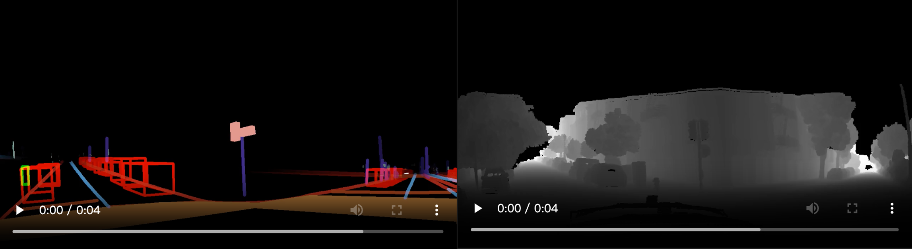
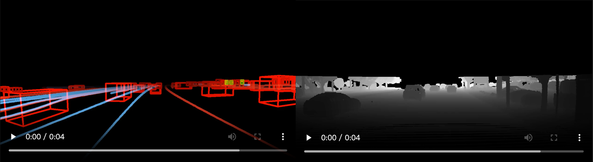
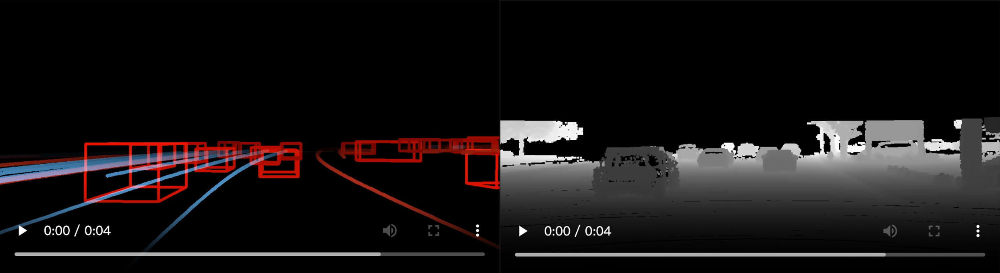

# Cosmos-AV-Sample Toolkits
This repo provides toolkits for:

* A rendering script that converts open-source datasets (e.g., Waymo Open Dataset) into input videos (LiDAR and HDMAP) compatible with [**Cosmos-Transfer1-7B-Sample-AV**](https://github.com/nvidia-cosmos/cosmos-transfer1).

* 10 examples (collected by NVIDIA) of input prompts in raw format to help understand how to interface with the model. We provide scripts to render the raw data into [**Cosmos-Transfer1-7B-Sample-AV**](https://github.com/nvidia-cosmos/cosmos-transfer1) input videos (LiDAR and HDMAP).

**[[Paper]]()**
**[[Model Code]](https://github.com/nvidia-cosmos/cosmos-transfer1)**
**[[Website]]()**

<div align="center">
  
</div>

## Quick Start

We provide pre-rendered examples [here](https://huggingface.co/datasets/nvidia/Cosmos-Transfer1-7B-Sample-AV-Data-Example/tree/main/examples) (rendered HDMAP / rendered LiDAR / text prompts). You can download and use these examples to test [**Cosmos-Transfer1-7B-Sample-AV**](https://github.com/nvidia-cosmos/cosmos-transfer1)!

## Installation
```bash
git clone https://github.com/nv-tlabs/cosmos-av-sample-toolkits.git
cd cosmos-av-sample-toolkits
conda env create -f environment.yaml
conda activate cosmos-av-toolkits
```

## Download Examples
We provide 10 examples of input prompts with HD map and LiDAR, to help test the model.
1. Add your SSH public key to your [user settings](https://huggingface.co/settings/keys) on Hugging Face.
2. Download the examples from [Hugging Face](https://huggingface.co/datasets/nvidia/Cosmos-Transfer1-7B-Sample-AV-Data-Example) (about 8GB):
```bash
git lfs install
git clone git@hf.co:datasets/nvidia/Cosmos-Transfer1-7B-Sample-AV-Data-Example
```

## Usage
You can use `render_from_rds_hq.py` to render the HD map + bounding box / LiDAR condition videos from RDS-HQ dataset. GPU is required for rendering LiDAR.
```bash
# single process
python render_from_rds_hq.py -i <RDS_HQ_FOLDER> -o <OUTPUT_FOLDER> [--skip hdmap] [--skip lidar]
```
You can add `--skip hdmap` or `--skip lidar` to skip the rendering of HD map and LiDAR, respectively.

You can also run this script in multiple processes to speed up the rendering process.
```bash
# multiple processes
torchrun --nproc_per_node=32 render_from_rds_hq.py -i <RDS_HQ_FOLDER> -o <OUTPUT_FOLDER> [--skip hdmap] [--skip lidar]
```
Set `nproc_per_node` to the number of processes you want to use.
**RDS-HQ Rendering Results**


> [!NOTE]
> If you're interested, we offer [documentation](./assets/ftheta.pdf) that explains the NVIDIA f-theta camera in detail.

## Convert Public Datasets

We provide a conversion and rendering script for the Waymo Open Dataset as an example of how information from another AV source can interface with the model. Note that our model is not trained on the Waymo dataset, and this script is intended to help users better understand our data format. As a result, a drop in generative video quality is expected. Finetuning on the desired custom dataset would be beneficial to improve quality.

### Waymo Open Dataset
Parsing tfrecords from Waymo Open Dataset requires extra dependencies; install it with
```bash
pip install waymo-open-dataset-tf-2-11-0==1.6.1
```

#### Step 0: Check Our Provided Captions
We provide auto-generated captions for the Waymo dataset at [`assets/waymo_caption.csv`](./assets/waymo_caption.csv). You will need these captions to run [**Cosmos-Transfer1-7B-Sample-AV**](https://huggingface.co/nvidia/Cosmos-Transfer1-7B-Sample-AV).

#### Step 1: Convert Waymo Open Dataset to RDS-HQ format
First, convert the Waymo Open Dataset to RDS-HQ format. Suppose you have a folder with Waymo Open Dataset's tfrecords, you can convert it to RDS-HQ format by:
```bash
python convert_waymo_to_rds_hq.py -i <WAYMO_TFRECORDS_FOLDER> -o waymo_demo -n 32
```
Here we specify the output folder as `waymo_demo`; you can change it to any other one. You can also increase the number of workers (`-n`) to your CPU cores to speed up the conversion.

#### Step 2: Render HD map + bounding box / LiDAR condition video from RDS-HQ format
Since we have converted Waymo Open Dataset's map labels and LiDAR points into the RDS-HQ format, we can render the HD map + bounding box / LiDAR conditioned video using the same script. The cameras in Waymo's Open dataset are pinhole camera models. To align with our model's training domain, we suggest using the same f-theta camera intrinsics to do the projection. We provide a default f-theta camera intrinsics in `config/default_ftheta_intrinsic.tar`, and you can render with f-theta camera by:
```bash
python render_from_rds_hq.py -d waymo -i waymo_demo -o waymo_demo_render_ftheta -c ftheta
```
here `-d` is the dataset name, you can find its configuration in `config/dataset_waymo.json`, `-i` is the input folder, `-o` is the output folder. `-c` is the camera type, default it will be `ftheta` camera.

(Optional) We also provide the pinhole camera rendering, which will be useful if you want to finetune the model on your own dataset with pinhole camera.
```bash
python render_from_rds_hq.py -d waymo -i waymo_demo -o waymo_demo_render_pinhole -c pinhole
```

You can also run this script in multiple processes to speed up the rendering process.
```bash
torchrun --nproc_per_node=32 render_from_rds_hq.py -d waymo -i waymo_demo -o waymo_demo_render_ftheta
```
Set `nproc_per_node` to the number of processes you want to use.

**Waymo Rendering Results (use ftheta intrinsics in RDS-HQ)**



**Waymo Rendering Results (use pinhole intrinsics in Waymo Open Dataset)**

<!-- ## Citation
```bibtex
``` -->
## Prompting During Inference
We provide a captioning modification example to help users reproduce our results. To modify the weather in a certain prompt, we use a LLM. Below is an example transformation request:
```bash
Given the prompt:
"The video is captured from a camera mounted on a car. The camera is facing forward. The video depicts a driving scene in an urban environment. The car hood is white. The camera is positioned inside a vehicle, providing a first-person perspective of the road ahead. The street is lined with modern buildings, including a tall skyscraper on the right and a historic-looking building on the left. The road is clear of traffic, with only a few distant vehicles visible in the distance. The weather appears to be clear and sunny, with a blue sky and some clouds. The time of day seems to be daytime, as indicated by the bright sunlight and shadows. The scene is quiet and devoid of pedestrians or other obstacles, suggesting a smooth driving experience."
Modify the environment to:
1. Morning with fog
2. Golden hour with sunlight
3. Heavy snowy day
4. Heavy rainy day
5. Heavy fog in the evening
...
```
You can use the modified text prompts as input to our model.